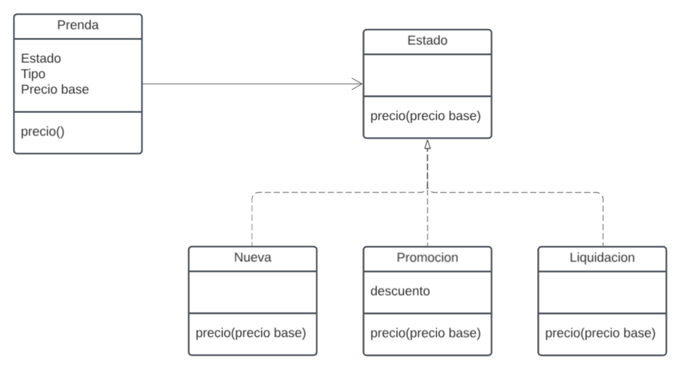
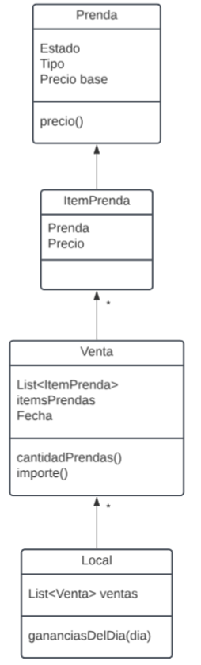

# Explicacion

## Prenda -> Estado 

La Prenda tiene un comportamiento segun su Estado, entocnes tome la decicion crear clases apartes para estas.
Como el Estado tenia distintos comportamientos cada uno (Nueva/Promocion/Liquidacion) opte por una interfaz con implementaciones cada una



### Nueva
```java
public class Nueva implements Estado {

  @Override
  public double precio(double precioBase) {
    return precioBase;
  }
}
```
### Promocion
```java
public class Promocion implements Estado {
  double descuento;

  public Promocion(double descuento) {
    this.descuento = descuento;
  }

  @Override
  public double precio(double precioBase) {
    return precioBase - descuento;
  }
}
```
### Liquidacion
```java
public class Liquidacion implements Estado {

  @Override
  public double precio(double precioBase) {
    return precioBase * 0.5;
  }
}
```

## Local ->* Venta ->* ItemPrenda -> Prenda

### Venta ->* ItemPrenda -> Prenda
Tuve en cuenta que las prendas
pueden ir cambiarndo de precio en el tiempo, asi que cree ItemPrenda para que cuando el precio de la Prenda cambie (o cambie tambien el estado) en el Historial siga conservando el precio con el que fue vendido

### Local ->* Venta
Esta solucion es la unica que se me ocurrio para poder juntar las ventas en un lugar, que a su vez me permita que macowins tenga mas de un local

)

### ItemPrenda 
```java
public class ItemPrenda {
  private Prenda prenda;
  private int cantidad;
  private double precio;

  public ItemPrenda(Prenda prenda, int cantidad) {
    this.prenda = prenda;
    this.cantidad = cantidad;
    this.precio = prenda.precio(); //El precio lo calcula el Estado segun el precio base de la Prenda
  }
}
```

### Venta
```java
public class Venta {
  protected Collection<ItemPenda> itemsPrendas;
  protected LocalDate fecha;

  public int cantidadDePrendas() {
    return itemsPrendas.stream().map(ItemPrenda::getCantidad).sum();
  }

  public LocalDate getFecha() {
    return fecha;
  }

  public double importe() {
    return itemsPrendas.stream().map(item -> item.getPrecio * item.getCantidad()).sum();
  }

  public Venta(Collection<ItemPenda> ItemPrendas, LocalDate fecha) {
    this.itemsPrendas = new ArrayList<>(ItemPendas);
    this.fecha = fecha;
  }
}
```

### Local
```java
public class Local {
  private Collection<Venta> ventas;

  public double gananciasDelDia(LocalDate dia) {
    return ventas.stream().filter(v -> v.getFecha().equals(dia)).mapToDouble(Venta::importe).sum();
  }

  public Local(Collection<Venta> ventas) {
    this.ventas = new ArrayList<>(ventas);
  }
}
```


## VentaTarjeta  -|> Venta
Esta solucion es la unica que se me ocurrio para poder juntar las ventas en un lugar, que a su vez me permita que macowins tenga mas de un local 

### VentaTarjeta
```java
public class VentaTarjeta extends Venta {
  private int cuotas;
  private double coeficiente;

  public VentaTarjeta(Collection<Prenda> prendas, LocalDate fecha, int coutas, double coeficiente) {
    super(prendas, fecha);
    this.cuotas = coutas;
    this.coeficiente = coeficiente;
  }

  @Override
  public double importe() {
    return coeficiente * cuotas + 0.01 * super.importe() + super.importe();
  }

}

```